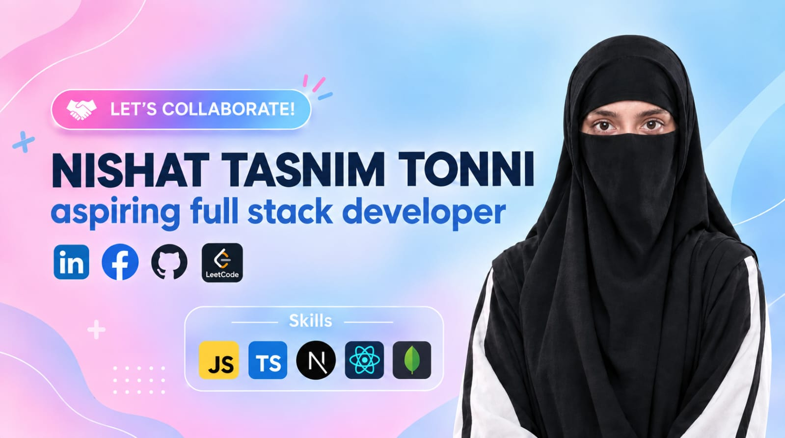

<h1 align="center">Hi 👋, I'm Nishat Tasnim Tonni</h1>
<h3 align="center">Mathematics Undergraduate | Aspiring Full-Stack & Modern Web Developer from Bangladesh 🇧🇩</h3>

  

---

### 💫 About Me

- 🎓 **Education:** Pursuing BSC in **Mathematics** at **Central University of Dhaka**
- 💻 **Focus:** Building Scalable Web Applications & Solving Complex Problems
- 🌱 **Currently Learning:** Next.js, React & MongoDB
- 💬 **Ask me about:** Frontend Development, Next.js, React & Mathematics
- ✉️ **Reach me at:** [nishattasnimtonni5@gmail.com](mailto:nishattasnimtonni5@gmail.com)

---

### 🛠️ Languages & Tools

---

### 🌐 Connect & Practice

  
  

---

  ⭐️ <i>Thanks for visiting my GitHub profile!</i>

